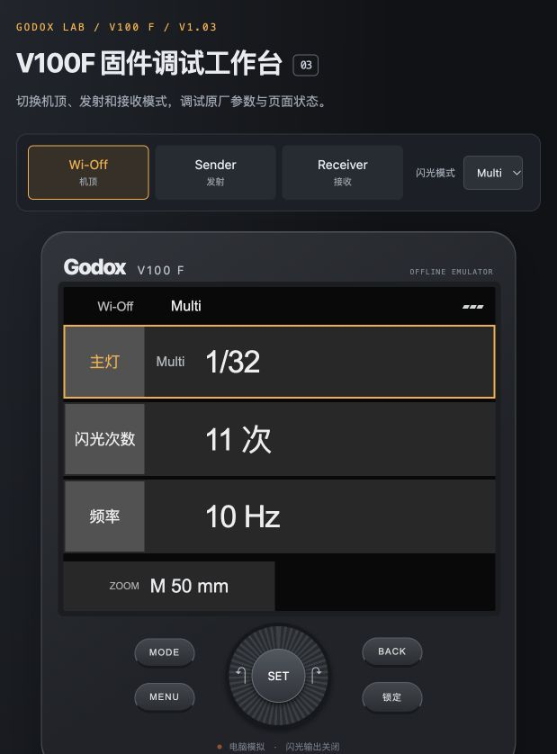
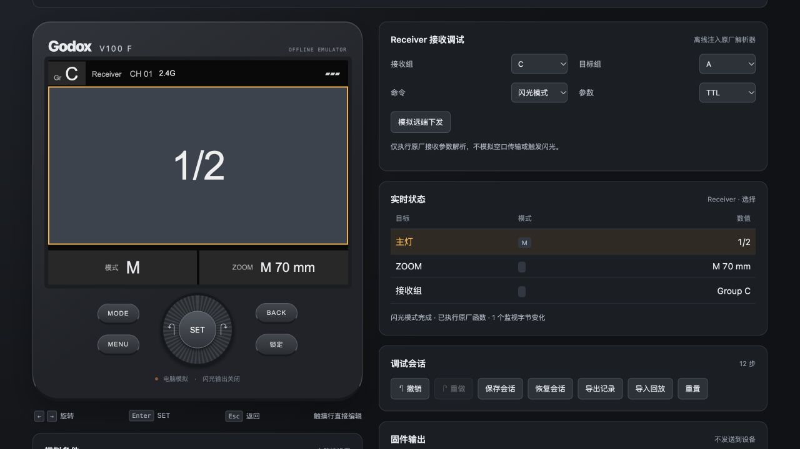

# Godox Firmware Mods · 神牛闪光灯固件修改项目

**简体中文** | [English](README.en.md)

这是一个神牛闪光灯固件逆向与功能修改项目，**目前覆盖 V100F/C/N/S/O 与 V480F；各型号均使用了最新原厂固件改写**。项目最初实现了旋钮直接调整 TTL 曝光补偿与 M 手动功率，之后为 V100 加入 SU-1 副灯手动控制和主控模式下操控体验的优化，并提供了离线调试工具。

作者在自用的 V100F 与 V480F 两台设备上已刷入本项目的固件，正常使用没遇到问题；各型号支持的功能见下表，实机反馈与验收范围记录在[设备状态](docs/HARDWARE_STATUS.md)。本项目为个人开源研究项目，与 Godox 官方无隶属关系。

## 实现的功能

| 使用模式 | V100 | V480 |
|---|---|---|
| 机顶模式 | 滚轮直接调整主灯 TTL或 M 档功率；副灯可独立调节手动功率 | 滚轮直接调整 TTL 曝光补偿或 M 功率 |
| 主控模式 | 增加副灯开关、功率调节及滑动操控，支持主灯关闭后副灯独立发光；单击灯组进入独立控制页，支持 TTL/M 切换、暂停/恢复，滚轮调整当前灯组数值| 单击灯组进入独立控制页，支持 TTL/M 切换、暂停/恢复，滚轮调整当前灯组数值|
| 从属模式 | 滚轮直接调整主灯 TTL 或 M 档功率；增加副灯独立开关与手动功率操控，优化副灯界面布局 | 滚轮直接调整 TTL 曝光补偿或 M 功率，TTL 补偿实时显示；从属组别 A–E 支持断电保存 |

## BIN 下载

### V100

| 设备 | 当前下载版本 | 文件 | 主要功能 |
|---|---|---|---|
| **V100F V1.03** | R10 experimental | [下载 V100F BIN](https://github.com/Shiba-inu666/godox-firmware-mods/releases/download/v100-r10-2026-10-10/v1.03r10.bin) | 机顶/从属模式 滚轮直接调整功率、从属/主控模式 副灯操控 、主控模式使用体验优化；已实机验收 |
| **V100C V1.11** | R10 experimental | [下载 V100C BIN](https://github.com/Shiba-inu666/godox-firmware-mods/releases/download/v100c-r10-2026-10-10/v1.11r10.bin) | 机顶/从属模式 滚轮直接调整功率、从属/主控模式 副灯操控 、主控模式使用体验优化；未实机验收 |
| **V100N V1.05** | R10 experimental | [下载 V100N BIN](https://github.com/Shiba-inu666/godox-firmware-mods/releases/download/v100n-r10-2026-10-10/v1.05r10.bin) | 机顶/从属模式 滚轮直接调整功率、从属/主控模式 副灯操控 、主控模式使用体验优化；未实机验收 |
| **V100S V1.06** | R10 experimental | [下载 V100S BIN](https://github.com/Shiba-inu666/godox-firmware-mods/releases/download/v100s-r10-2026-10-10/v1.06r10.bin) | 机顶/从属模式 滚轮直接调整功率、从属/主控模式 副灯操控 、主控模式使用体验优化；未实机验收 |
| **V100O V1.04** | R10 experimental | [下载 V100O BIN](https://github.com/Shiba-inu666/godox-firmware-mods/releases/download/v100o-r10-2026-10-10/v1.04r10.bin) | 机顶/从属模式 滚轮直接调整功率、从属/主控模式 副灯操控 、主控模式使用体验优化；未实机验收 |

### V480

| 设备 | 当前下载版本 | 文件 | 主要功能 |
|---|---|---|---|
| **V480F V1.03** | R10b experimental | [下载 V480F BIN](https://github.com/Shiba-inu666/godox-firmware-mods/releases/download/v480-r10b-2026-10-10/v480f-v1.03r10b.bin) | 机顶/从属模式 滚轮直接调整ttl/M 档功率、主控模式使用体验优化；已实机验收 |

## 模拟器预览

项目还提供 **V100F 浏览器离线模拟器（调试工作台）**，可切换机顶、主控和从属模式，观察参数调整、内存变化与调用记录。[启动与使用说明](docs/debugger/README.zh-CN.md)。

## 文档与源码

| 想做什么 | 入口 |
|---|---|
| 查看单款机型的功能范围、版本细节与已知限制 | [V100F 说明](docs/devices/V100F.md) · [V100 C/N/S/O 说明](native/ports/README.md) · [V480F 说明](docs/devices/V480F.md) |
| 了解开发历程与历次问题修复 | [中文完整历程](docs/PROJECT_HISTORY.md) · [更新记录](CHANGELOG.md) |
| 核对实机反馈与硬件验收范围 | [两台设备的状态](docs/HARDWARE_STATUS.md) |
| 从原厂固件复现、还原或校验补丁 | [统一复现指南](docs/REPRODUCE.md) |
| 阅读实现源码 | [V100 C / 汇编](native/src/) · [V480 汇编](v480/src/) · [目录结构说明](DIRECTORY_LAYOUT.md) |
| 查看固件格式、测试方案与副灯 TTL 研究 | [技术文档索引](docs/README.md) |
| 在电脑端观察参数与调用流程 | [调试工作台](docs/debugger/README.zh-CN.md) |
| 反馈问题或参与贡献 | [贡献说明](CONTRIBUTING.md) · [提交 Issue](https://github.com/Shiba-inu666/godox-firmware-mods/issues/new/choose) |

## 项目进度

项目从两款机型的固件格式与 ARM 输入链路逆向分析起步，先实现了旋钮直接调整闪光灯 TTL 曝光补偿与 M 手动功率的功能，之后逐步修复 V100 无线模式下副灯 UI 异常、TEST 与实际曝光分支冲突、主灯关闭后副灯独立工作、界面重叠缺字等问题。V480 在机顶旋钮直调基础上加入主控单灯页、从属直调与组别记忆。所有问题现象、修改理由与验证依据记录在中英文项目历程中。

目前已公开可复现源码与离线测试记录：V100F R7 基线的可移植子集包含 9,399 项功能检查与 90 项独立 TTL 研究观测；V480 单机型通过 12,489 项功能检查、746 次条件中断注入、1,386 次整镜像执行与 10 项补丁工具测试。R10 的新增验证分别记录在 F 版与 C/N/S/O 版说明中。

**以上均为电脑端自动化校验结果。完整的实机全场景验收、光量长稳与升级失败恢复机制尚未完成。**
[验证说明](docs/native/VALIDATION.md) · [恢复与安全机制](docs/native/RECOVERY.md)

项目定名为 **Godox Firmware Mods**。文档架构参考了哈苏、理光与 FujiHack 等成熟固件研究项目，具体参考来源与借鉴范围见[参考项目](docs/REFERENCES.md)。
