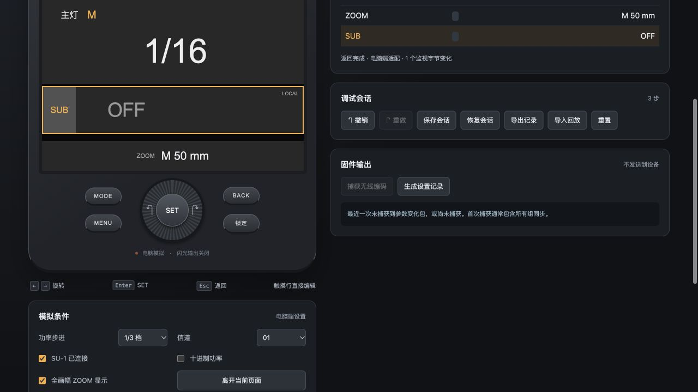

> This guide describes only the desktop debugger, not the native firmware patch.

# V100F Firmware Debugger · v3

[简体中文](README.zh-CN.md) | **English**

An offline, browser-based debugging workbench for **Godox V100F V1.03**. Explore **Wi-Off, Sender and Receiver** roles, TTL, manual flash (M), Multi and common menu settings. Parameter adjustments execute selected original ARM Thumb routines in Unicorn; the desktop adapter supplies the interface, input events and simulated device state.

神牛 V100F 多模式离线固件调试工作台：支持机顶、发射、接收和频闪参数调试，以及内存监视、调用记录与会话回放。

**The repository does not include vendor firmware or user sessions.** Supply the matching firmware locally. This is an independent debugging tool, not a complete device emulator or firmware ready to flash. It does not operate flash hardware, communicate over radio or write to a device.

## Setup

Requires Python 3.11 or later. Verified locally on macOS with Python 3.14.

1. Clone the repository:

   ```sh
   git clone https://github.com/Shiba-inu666/godox-v100-debugger.git
   cd godox-v100-debugger
   ```

2. Place your own matching firmware file at `firmware/V100F_V1.03.bin`. Only this exact sample is supported:

   - Size: **1,002,732 bytes**
   - SHA-256: `fe92fbacce29e2ec22784371900f73bbe3e5052c49cc7e66845c276ab5fc7787`

   The program rejects a missing or mismatched file. The binary is excluded from Git. See the [firmware notes](../../firmware/README.md) for details.

3. Install and launch on macOS / Linux:

   ```sh
   python3 -m venv .venv
   .venv/bin/python -m pip install -r requirements.txt
   .venv/bin/python debug/server.py --open
   ```

   On Windows, use `.venv\Scripts\python.exe` for the installation and launch commands. Windows operation has not been separately verified.

Open <http://127.0.0.1:8765/>. After setup, macOS users can also double-click `启动调试.command`. Stop the server with Ctrl+C.

## Features

| Area | Available behavior |
|---|---|
| Wi-Off · TTL | Local flash exposure compensation and original ±3 EV limits |
| Wi-Off · M | Manual power, ZOOM and local SUB enable / power controls |
| Sender · Group | M → SUB → A → B → C → D; TTL / M / OFF for the five original targets, ZOOM and overall adjustment |
| Receiver · TTL / M | A–E group selection, separate power slots and ZOOM; TTL has no added local compensation |
| Multi · all three roles | Whole-stop power from 1/256 to 1/4, 1–100 flashes, 1–100 Hz and ZOOM |
| Receiver parameter injection | Simulate incoming mode, power, count and frequency parameters; original code applies destination filtering |
| Menu | Power display and step, S1/S2, TCM, distance units, standby, automatic power-off, modeling-light behavior, screen settings, ZOOM format and device language setting |
| Debugging | Memory inspection, call traces, captured Sender encoding, a 79-byte settings record, undo / redo and session replay |

## Controls

- Select a role and flash mode at the top.
- Click a screen row to edit, or turn the dial to select it and press SET. Turn again to adjust; SET or BACK exits editing.
- Wi-Off has one SUB entry in the main area.
- Receiver places the group selector at the top left, mode selection at the bottom left and ZOOM at the bottom right.
- MENU opens the settings list.
- Arrow keys turn the dial, Enter acts as SET and Escape acts as BACK. The mouse wheel also works over the dial.

The browser interface currently uses Chinese labels with standard flash terms such as TTL, M and ZOOM. This English guide does not change the interface language. The simulated device-language setting only stores a value.

The server binds to the local machine only. All tabs share one session; refresh another tab to see changes. A page refresh preserves the session. After a server restart, use the restore control to reload a saved session.

## Try a debugging sequence

1. Choose Wi-Off → TTL, edit the main light and increase once. Check for +0.3 EV.
2. Switch to Multi and adjust power, flash count and frequency.
3. Choose Receiver → M → group C. Inject a power parameter addressed to A and confirm it is ignored; address the same parameter to C and confirm it is applied.
4. Open MENU, set S1/S2 optical triggering to S2 and inspect the recorded change.
5. Export the session, import it and replay individual steps or the complete sequence.

## Sessions

Save writes the action list to `sessions/saved-session.json`; restore reconstructs state by executing those actions. Schema 2 and 3 sessions are accepted only when their firmware hash matches. Invalid imports preserve the current session; version 1 state-only files cannot be replayed.

Sessions allow up to 1,000 actions. The call panel shows the latest 80 entries, and exports include all actions plus up to 300 log entries. Reset clears the active session, not saved files. Starting a new branch of actions after undo clears the redo history. Local session files are excluded from Git.

## Scope

Only selected original routines execute. Role switching, layouts, GUI objects, menu navigation and some setting writes use desktop adapters. Receiver injection calls the original parameter parser, not the full radio interrupt or transport chain. Some menu items call original callbacks; others write confirmed simulated RAM fields.

Actual radio communication, flash firing, charging, thermal protection, pairing, sleep, power-off and MCU GUI patching are not implemented. Brightness, standby and similar settings do not control real hardware. Initial values form a repeatable test scenario, not claimed factory defaults. Run Python without `-O` so the emulator integrity checks stay enabled.

## Validation

With the matching local firmware available:

```sh
.venv/bin/python -m unittest discover -s tests -v
```

The published package passed **26 tests**, covering mode limits, group isolation, Receiver address filtering, menus, session compatibility, replay and HTTP save / restore. Browser checks additionally covered the single Wi-Off SUB entry and the Receiver group, mode and ZOOM controls.

- [Test source](../../tests/)
- [Architecture and firmware mappings — Chinese](../ARCHITECTURE.md)
- [Multi preview](../../debug-preview-v3.jpg)

Receiver layout:


Wi-Off layout:


