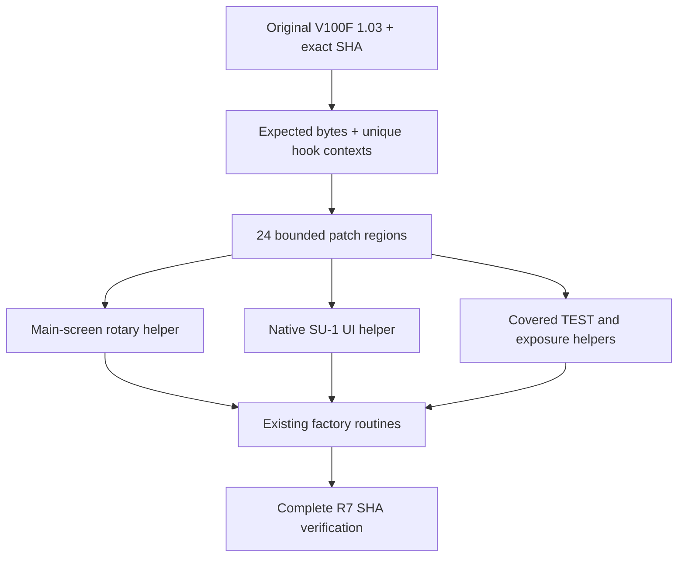

# 原生架构与证据 / Native architecture and evidence

## 固件身份 / Image identity

| 样本 / Sample | 字节 / Bytes | SHA-256 |
|---|---:|---|
| V100F V1.03 | 1,002,732 | `fe92fbacce29e2ec22784371900f73bbe3e5052c49cc7e66845c276ab5fc7787` |
| V480F V1.03，历史对照 / historical comparison | 753,705 | `84ca232f50a62ceb2d9b24017a3b447a7154bf63f6461ef546a30a6b29077ebf` |

以下记录针对这两个精确样本，不是对整个产品系列的推断。CONFIRMED 表示有文件或指令证据；PROBABLE 表示还需要板级确认；UNKNOWN 表示没有拿到证据。

These observations concern the exact samples. CONFIRMED means file/instruction evidence, PROBABLE requires further confirmation, and UNKNOWN means unresolved.

| 事项 / Item | 证据 / Evidence | 状态 / Status |
|---|---|---|
| 主应用 ISA / Main ISA | 小端 ARM M-profile、Thumb-2，向量与可执行指令一致 / Little-endian M-profile and Thumb-2, matching vectors and executable code | CONFIRMED |
| 主映射 / Main mapping | `0x08008000`；Reset `0x0800829D`；V100 SP `0x200AD668`，V480 SP `0x2005FA98` | CONFIRMED |
| MCU | Cortex-M4 / GD32F4xx，V100 GD32F470 候选 / Candidate family, not a board marking | PROBABLE |
| 局部压缩 / Local compression | 启动 scatter 初始化有压缩内容；V100 已识别一段 896 → 2,872 字节 / Compressed initialization section | CONFIRMED |
| 整体加密 / Whole-image encryption | 可直接解释向量、Thumb 指令、资源；不支持“整文件密文”假设 / Directly interpretable code/resources | No whole-image encryption indication; not proof about every section |
| V480 尾部 / Trailer | `[0xB8000, 0xB8029)`：16 字节 MD5、15 字节文件名、2 字节长度、`AA55669977882233`；MD5 覆盖前 `0xB8000` 字节 | CONFIRMED; MD5 is not a digital signature |
| V100 同类尾部 / Equivalent trailer | 未找到 V480 同类尾部 / No equivalent V480 trailer identified | No format interchangeability |
| V100 设备校验、签名 / Device integrity/signature | 校验覆盖范围与验证机制未建立 / Coverage and verifier not established | UNKNOWN |
| 辅助负载 / Auxiliary payload | 两者相同的 19,692 字节；独立映射 `0x08002000`，SP `0x20000AB8`、Reset `0x08002139` | Shared bytes CONFIRMED; controller role PROBABLE |
| 可恢复 bootloader / Recovery bootloader | 辅助负载不足以证明主应用损坏后可恢复 / Auxiliary code alone is not recovery evidence | UNKNOWN |

共享辅助负载 SHA-256：`c5dbaca630a3002d0fb090c886a9b8b6a68a0ebd9785f7efc6c0a43db379875a`。两款设备在共同启动与 UI 结构上和这个负载对应的框架有关联，但 V480 的偏移从来没有被用到本次 V100 R7 上。

The shared payload and startup/UI similarities support a framework relationship. They do not justify transplanting offsets. This public R7 operates on V100F only.

## R7 补丁结构 / Patch structure

| 区域 / Area | 运行地址 / Runtime address | 长度 / Size | 公开源 / Source |
|---|---|---:|---|
| 旋钮 / Rotary | `0x080BDD00` | 508 | [fixed_main.S](../../native/src/fixed_main.S) |
| 发光 / Firing | `0x080BE000` | 476 | [fire_su1.S](../../native/src/fire_su1.S) |
| UI | `0x080BE800` | 3,003 | [native_sub.c](../../native/src/native_sub.c)、[trampolines](../../native/src/native_trampolines.S) |

上面是映射后的 MCU 地址，文件偏移需要减去 `0x08008000`。生成器直接使用精确记录，不需要使用者手工改偏移。入口钩子包括 4 处旋钮、6 处发光、11 处 UI，再加上 3 个辅助区，共 24 处。实际不同的字节是 4,018；区域长度总和和差异字节数是两个不同的计数。

These are mapped MCU addresses; subtract the image base for file offsets. The patcher applies recorded changes rather than asking users to edit offsets. Four rotary, six firing and eleven UI hooks plus three helper areas make 24 regions. The count of bytes that actually differ is 4,018.

向量区前 `0x1B4` 字节，以及文件 `0xF0000` 之后的辅助负载保持不变。补丁不是只改一个分支：需求从旋钮一路扩展到 UI 和发光，代码最终落到三个受限模块，不能再叫最初设想的"几十字节修改"。

The first `0x1B4` vector bytes and auxiliary bytes from file offset `0xF0000` remain unchanged. Scope expanded from a rotary branch to UI and firing support, so the final result is three bounded helpers, not the initially hoped-for few-byte patch.

## 参数与路径 / Parameters and paths

- 主灯 TTL 仍调 FEC，原 TTL 测光路径没有被重写。Main TTL retains its original metering path and FEC semantics.
- 主灯 M 调整复用原函数；副灯是 1/128–1/1、1/3 EV 手动设置。Main M reuses stock adjustment; SUB is manually set from 1/128 to 1/1 in thirds.
- 已覆盖正常曝光使用原主灯结果与本地副灯设定，不把 A–D 无线组参数当副灯参数。Covered normal exposure keeps original main results and local SUB settings, separate from radio groups.
- 准入、原字节与符号记录见 [rotary](../../native/metadata/rotary.json)、[fire](../../native/metadata/fire.json)、[UI](../../native/metadata/ui.json)；实际发布字节见 [R7](../../native/patches/r7.json)。
- UI 使用原厂控件、字体与回调；电脑端工作台是另一套适配界面。Native UI uses factory controls/fonts/callbacks; the desktop UI is a separate adapter.

## 原则与限制 / Design boundaries

原厂未就绪、无线发送、主曝光、预闪与 TEST 不是同一条路径。复用某段原函数仍然要核对 ABI、寄存器、对象生命周期和调用条件。公开 lab 执行部分原厂指令并替代外设，这不是完整的芯片仿真。

Readiness, radio transmission, main exposure, preflash and TEST are distinct paths. Reusing stock functions still requires correct ABI, registers, object lifetime and entry conditions. The public lab executes selected original instructions with peripheral stand-ins, not a complete MCU model.
