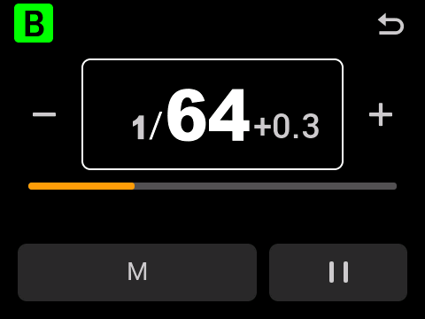
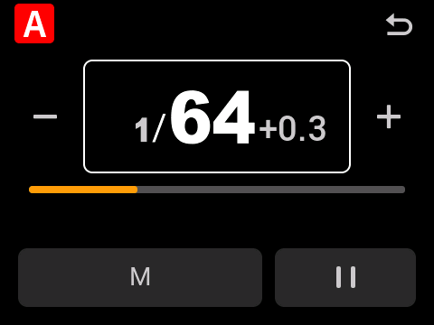

# V100 C / N / S / O · R10

这四个版本分别从对应型号的原厂 BIN 构建。功能参照 [V100F R10](../r10/README.md)，地址、分组规则、启动数据和原厂资源按型号处理。

**四款均为实验版，尚无实机验收。** 2026-10-10，作者确认暂时没有 C/N/S/O 实机。这里的测试在电脑上的 ARM / LVGL 环境中运行，不代表已确认刷入、光量、相机时序或长时间连拍表现。

## 下载

| 型号 | 原厂版本 | 修改版 BIN | 发布页 |
|---|---|---|---|
| V100C | 1.11 | `v1.11r10.bin` | [C 版下载与校验](https://github.com/Shiba-inu666/godox-firmware-mods/releases/tag/v100c-r10-2026-10-10) |
| V100N | 1.05 | `v1.05r10.bin` | [N 版下载与校验](https://github.com/Shiba-inu666/godox-firmware-mods/releases/tag/v100n-r10-2026-10-10) |
| V100S | 1.06 | `v1.06r10.bin` | [S 版下载与校验](https://github.com/Shiba-inu666/godox-firmware-mods/releases/tag/v100s-r10-2026-10-10) |
| V100O | 1.04 | `v1.04r10.bin` | [O 版下载与校验](https://github.com/Shiba-inu666/godox-firmware-mods/releases/tag/v100o-r10-2026-10-10) |

文件名已经简化，下载前仍需核对发布页上的型号。**不同后缀不能混刷。** 原厂下载地址、版本、长度与 SHA-256 记录在 [upstream.json](upstream.json)；不在仓库里附原厂 BIN 或 ZIP。

## 操作

- 主控列表保留原厂长按切换 TTL / M / OFF、横向滑动调整、上下滚动和加减按钮。单击灯组进入该组的独立控制页。
- 单灯页左侧切换 TTL / M，右侧暂停或恢复。暂停时可以预选恢复模式；旋钮只调整该灯的手动功率或 TTL 曝光补偿。
- 左上角字母沿用本型号原厂从属页的字体、圆角、大小与颜色。C 版为 **A–E**，E 为紫底白字；N/S/O 为 **M、A–D**。
- 主控 S 行可左右拖动副灯功率；单击进入副灯页。副灯页也支持触控拖动，旋钮固定调整副灯功率。
- 从属页使用“副灯”，英文为 SUB；退出时随整个页面一起消失。主控 S 的字高与原厂组名字号一致。
- 机顶及从属主界面支持旋钮直调。本地副灯使用独立的手动功率，覆盖测试中的普通闪光、TEST、无线接收和主控本机灯关闭后副灯单独输出路径。

副灯 TTL 尚未实现。此次没有增加副灯 HSS 或 Multi。主控各灯组的 TTL 选项仍由原厂主灯/远程灯组逻辑处理，不能理解为副灯 TTL。

## 离线验证

每款独立检查原厂输入身份、触控事件、模式/暂停状态、参数隔离、旋钮、原厂数值格式与徽标像素、中英文标签、页面退出与释放、普通闪光门控、无线接收、被排除模式的分派，以及完整 BIN 的改动边界。详细结果见 [evidence](evidence/)。

模拟环境替代物理触控采样、LCD 传输、部分延时/完成服务和无线传输；执行原生界面及对应固件指令。射频与 GPIO 检查观察的是请求及寄存器操作，不是物理输出测量。四款的覆盖范围与 F 版历史测试数量不同，不能把 F 版报告当作这些型号的验收结果。

## 本次结果

| 型号 | 功能检查 | 镜像检查 | 实机验收 |
|---|---:|---:|---|
| V100C | 3,988 | 105 | 未进行 |
| V100N | 3,972 | 105 | 未进行 |
| V100S | 3,972 | 105 | 未进行 |
| V100O | 3,972 | 105 | 未进行 |

原生渲染预览（电脑离线运行，不是实机照片）：

| C 版 | N 版 |
|---|---|
|  |  |

| S 版 | O 版 |
|---|---|
|  |  |

## 复现

需要 Python 3、`unicorn`、`capstone`，以及支持 `arm-none-eabi` 的 LLVM 20（clang、ld.lld、llvm-objcopy、llvm-nm）。macOS Homebrew 路径可自动发现；其他安装位置可设置 `PORT_CLANG`、`PORT_LD`、`PORT_OBJCOPY`、`PORT_NM`。

```sh
python native/ports/build.py V100C_V1.11 /path/to/V100C_V1.11.bin native/ports/.lab/V100C_V1.11
python native/ports/validate.py V100C_V1.11 /path/to/V100C_V1.11.bin
```

N/S/O 对应配置名是 `V100N_V1.05`、`V100S_V1.06`、`V100O_V1.04`。输出放在各自的 `.lab` 目录。构建器先检查原厂完整 SHA 和补丁前字节，编译本型号固定源码，再核对预留空白区、跳转、镜像长度和未修改字节。它不会自动猜测其他版本的地址，也不会访问设备。

`profiles` 固定各型号地址及输入身份；`src` 保存各型号 C/汇编；`lab` 使用统一的逻辑操作编号调用对应型号的地址。逻辑编号中保留 F 版旧测试的数值，不表示在其他型号上直接调用 F 地址。构建本身不需要 F 版原厂固件。

## English

These are separate R10 ports for V100C 1.11, V100N 1.05, V100S 1.06 and V100O 1.04. Canon retains its native A–E group layout; the others retain M/A–D. Each image has its own pinned original SHA, fixed source, hooks, native fonts and offline report. Cross-model input is rejected.

The ports provide native gestures plus tap-to-open group editors, TTL/M and pause controls, value-only encoder handling, native colored badges, SUB dragging and UI lifetime fixes. Covered normal firing paths retain independent manual SUB power. SUB TTL/HSS/Multi extensions are not implemented.

**All four are prereleases without hardware acceptance.** No C/N/S/O hardware was available. Offline GPIO/RF observations are not measurements of flash output, camera compatibility, timing, thermal behavior, update success or recovery.
