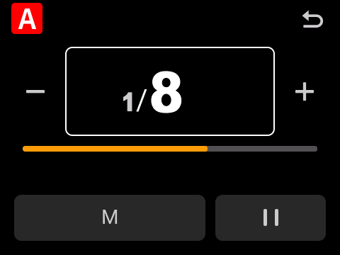
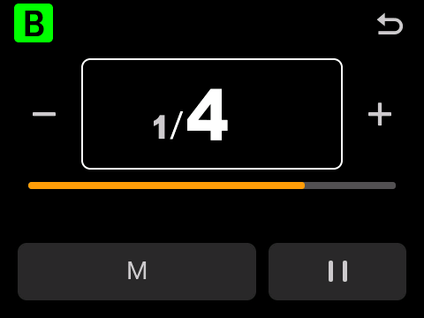
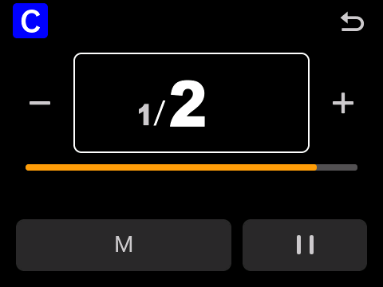
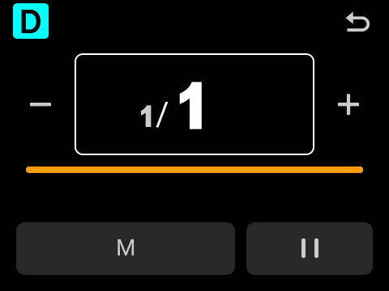
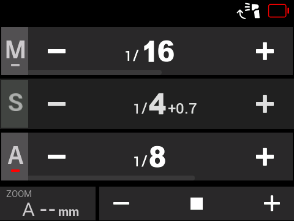
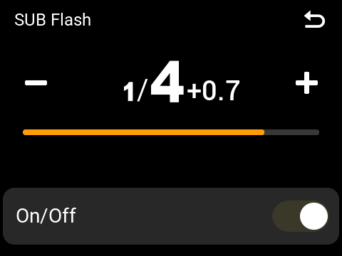

# V100F V1.03 · R10 彩色组名与副灯拖动

在 [GitHub R9](https://github.com/Shiba-inu666/godox-firmware-mods/releases/tag/v100-r9-2026-10-10) 的独立灯组页和输入逻辑上，补上原厂彩色组名以及主控列表 S 行的功率拖动。R9 发布文件和源码保留不变。

## 变化

- 单灯页左上角 A/B/C/D 使用原厂从属页的 **44×44 像素、5 像素圆角**字母块。A 红底白字、B 绿底黑字、C 蓝底白字、D 青底黑字；直接读取原厂调色表和 29 像素字库。M 保留原有灰色字母。
- 主控列表 S 行的数值区域支持左右拖动：右移增大功率，左移减小功率。沿用原厂副灯加减的 **1/3 档**步进，范围 **1/1–1/128**，从按下时的功率相对调节，不因按下位置跳变。
- 短按 S 或数值仍打开副灯页；小幅手抖不调功率；已判定为拖动的手势松开后不打开副灯页。纵向手势仍用于滚动原主控列表。
- 副灯 OFF、未连接、锁定、切屏或下拉面板活动时，S 行拖动不改变功率。拖动不改 M/A–D 的功率、模式或无线启用状态。
- 机顶、主控、从属模式的副灯独立页本来就有原生拖动调节，本版保留并重新检查；独立页旋钮继续只调功率。
- M/A–D 长按 TTL/M/OFF、列表滑动、单击独立页、TTL/M 与暂停/恢复和旋钮逻辑继续沿用 R9。副灯仍为手动，没有新增 SU-1 TTL。

原厂接收页的 A/B/C/D 色值（RGB565）为 `F800 / 07E0 / 001F / 07FF`。验证使用官方 V1.03 的真实 ARM 指令与 LVGL 渲染，将原厂色块与新单灯页色块逐像素比较；不从手机照片估算颜色。

## 构建与验证

```sh
.venv/bin/python native/r10/build.py
.venv/bin/python native/r10/validate.py
.venv/bin/python native/r10/package.py native/r10/out/r10
```

构建使用精确原件 `firmware/V100F_V1.03.bin`，沿用 R7 补丁基线和 R9 的完整输入修复。可传入 `--github-base /path/to/R7.bin` 核对重建 R7 与 GitHub 文件的字节一致性。R9 回归对照从公开补丁清单重建，不需要额外下载或构建 R9。工具链配置见 [R9 说明](../r9/README.md)。

新手势状态保存在 S 行自身的 LVGL `user_data` 中，跟随界面释放；没有新增固定全局 RAM。彩色字母块不截获触摸。原有发光/RF 补丁、原厂参数函数和 R7 旋钮辅助段保留。

仅适用于 **V100F V1.03**。该实验候选尚待真机验收；离线环境替代物理触摸、GPIO 和 LCD 传输，不模拟完整硬件或真实光量。本轮未写入设备。

## English

R10 extends the published R9 with exact native Receiver-style A/B/C/D badges in each Sender group editor, and relative left/right power dragging on the Sender S row. The badge uses the original palette, font, text contrast, 44×44 size and 5-pixel corner radius. M retains its gray letter.

S-row dragging follows the native one-third-stop SUB +/- rules and clamps at 1/1–1/128. Taps still open the editor, vertical gestures scroll the list, and dragging does not change other groups. Native SUB editor dragging in all three roles and R9's power-only encoder are retained. SUB TTL is not implemented. Reproduce and validate with the commands above; physical-device acceptance remains pending.

## 本轮结果 / Results

- **13,966 项原生功能检查、37 项镜像完整性检查通过**：R9 输入/UI 回归 2,797 项，新色块/副灯拖动 1,807 项，既有原生回归 9,362 项。
- A/B/C/D 在 TTL、M、OFF 三种状态下的字母块均与官方原件从属页逐像素一致，共 12 次完整色块比较。
- 连续开关单灯页 50 次，动画回收后已分配堆空间不高于预热基线 **43,672 字节**。
- BIN 大小 **1,002,732 字节**，SHA-256：`250523b8634d75e2ccb3124cd80695def5e8b056c79e71cee4fd4c0e4924353d`。
- [完整验证](evidence/VALIDATION.json) · [新增功能验证](evidence/R10_CHANGES_RESULTS.json) · [镜像完整性](evidence/IMAGE_INTEGRITY.json)。

截图来自实际原生绘制。仅截图 VM 使用单缓冲；功能测试与交付固件保留原显示配置。以下预览不代表实体 LCD 验收。

| A | B |
|---|---|
|  |  |

| C | D |
|---|---|
|  |  |

| 主控列表副灯拖动后 / SUB after drag | 副灯独立页 / SUB editor |
|---|---|
|  |  |
