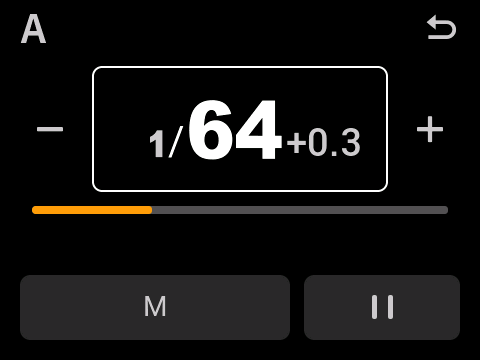
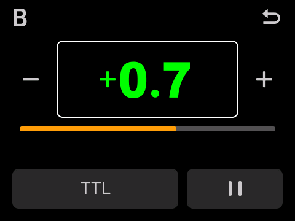
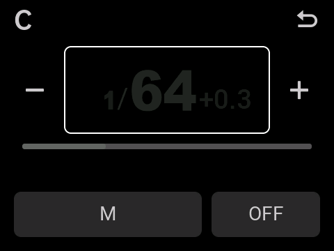

# V100F V1.03 · R9 原生手势与单灯功率控制

基于 GitHub 当前发布的 V100F R7，继续保留本地 R8 的副灯名称、退出生命周期和 S 字号修复。已重新核验远程主分支 `d445b7f342ef12c9ac7878c06beb9dbbed5e6b56`，最新发布仍为预发布版 `v100-v480-2026-10-09`；V100F R7 的 SHA-256 为 `8c07a4f6672ffa575081d2aa11df29c50487f978aa6155321c95a19cb032c761`。

## 操作

| 位置 | 操作 | 结果 |
| --- | --- | --- |
| 主控列表 M/A/B/C/D | 短按灯名或数值 | 打开该灯的独立控制页 |
| 主控列表 | 原来的长按 | 沿用原厂 TTL / M / OFF 循环及长按时序 |
| 主控列表 | 横向滑动功率、纵向滚动 | 保留原厂滑动调节与列表滚动；松手不打开独立页 |
| 主控列表 | 加减按钮 | 继续直接调节该灯 |
| 单灯页 | 左下 TTL/M | 切换该灯模式；暂停时只预选恢复模式 |
| 单灯页 | 右下暂停图标 / OFF | 暂停 / 恢复，保留模式、M 功率和 TTL 补偿 |
| 单灯页 | 左右减加、下方滑条 | 调整该灯的 M 功率或 TTL 曝光补偿 |
| 单灯页 | 旋钮 | 始终调整当前灯数值；不导航、不切模式、不退出 |
| 单灯页 | 右上返回、实体返回键 | 回到主控列表，焦点回到该灯 |

单灯页使用与原厂“副灯”相同的 61 像素大号数字及分数排版。TTL 显示直接复用原厂正负号与 1/3 档舍入，例如 `+0.7`。M/TTL 和暂停键的布局参考用户提供的 X3 照片。

S 继续使用原厂副灯页和手动功率；本次也约束该页的旋钮只调副灯功率。S 没有新增 TTL。建模灯、同步模式等未列入本轮。

## 实现与边界

- 原厂灯组行、透明功率滑条、组名字块的触摸标志和原有回调全部保留。附加短按观察器在原厂回调之后执行，跟踪长按、取消和超过 8 像素的移动；往返拖动也不会变成短按。
- 独立页只把数值控件加入旋钮焦点组。解码、数值消费和 GUI 读取入口仅在独立灯组页或原厂副灯页打开时采用固定目标，丢弃导航增量；原厂参数处理继续执行。SET、模式、暂停和加减操作后旋钮用途不变。
- 原厂 FEC 编码、显示舍入、加减和旋钮步进保持原生行为。新单灯滑条的 M 步进跟随原厂 0.1 / 1/3 档设置，TTL 使用原厂 1/3 档位置；列表原有滑条不改。
- 暂停对应原厂 OFF，同时更新该组模式、启用位和无线掩码；不改其他组或 S。OFF 前的模式保存在当前页面对象中，关闭/重开单灯页可恢复。这个额外记忆不会跨关机或重建整个主控页面保存。
- 所有新增状态跟随 LVGL 页面对象和控件释放，无新增固定全局 RAM 地址。强制切换页面时先释放独立页，避免占用原厂固定 GUI 堆。
- 发光、保护和无线相关补丁、原有旋钮辅助段逐字节保留 R7；旋钮四个入口新增独立页限定处理，其他页面进入原有 R7 路径。
- R8 的从属页“副灯”名称、正常退出期间随整屏一起释放、主控 S 的 29 像素组名字形继续保留。

## 构建与验证

```sh
.venv/bin/python native/r9/build.py
.venv/bin/python native/r9/validate.py
.venv/bin/python native/r9/package.py native/r9/out/r9
```

原件必须是精确匹配 SHA 的 V100F V1.03。可对构建命令使用 `--github-base /path/to/R7.bin`，要求已下载的 GitHub R7 与本地重建结果逐字节一致。工具链与 R8 相同；可设置 `GODOX_LLVM_BIN` 和 `GODOX_LD_LLD`。

验证运行实际 ARM 指令和 LVGL 对象，包括原厂触摸长按计时、拖动、原生渲染、旋钮 GPIO 相位 → 批量消费 → GUI 轮询、暂停与跨组隔离、完整页面生命周期，以及既有副灯、发光、就绪和调用约定回归。触摸采样、GPIO、LCD 传输和少量唤醒/蜂鸣服务由测试环境替代。

生成器要求候选镜像、源代码与各验证报告的摘要匹配，并验证完整逆变换可恢复官方原件。新输出目录必须不存在，避免覆盖旧固件。

仅适用于 **V100F V1.03** 的实验固件。离线验证不等于真机验收；触摸手感、实体旋钮、LCD 观感和实际受控灯仍需上机复测。本轮未写入设备。

## 本轮交付与验证（2026-10-10）

- **12,159 项原生功能检查通过**：R9 UI/输入链 2,797；既有副灯、下拉、发光、OFF 独立控制、就绪与调用约定回归 9,362。
- **37 项镜像完整性检查**、原有补丁工具 10 项与桌面调试器 26 项测试通过。
- 连续开关独立页 50 次，执行原厂动画回收后，后续各轮已分配堆空间不高于预热基线 43,672 字节。
- BIN 大小 **1,002,732 字节**；SHA-256：`6373f518f30e0582c9fde4c18efc6da81978207bbd8def1781219c2ddd3e24e5`。
- 源码与测试报告摘要绑定在 [VALIDATION.json](evidence/VALIDATION.json) 中；[输入链与界面检查](evidence/R9_UI_RESULTS.json) · [镜像完整性](evidence/IMAGE_INTEGRITY.json)。
- 本轮既有套件先对同一最终 BIN 全部执行通过；调整离线截图实现后，重新执行 UI 与镜像检查，并按候选、共享源文件及结果摘要复用同一轮旧套件结果。`validate.py --reuse-legacy` 只允许这种一致性复用；默认命令仍全量执行。

下图执行原生绘制与字库。仅截图 VM 使用单缓冲，因为离线环境不模拟硬件双缓冲同步；功能测试 VM 与交付固件保持原厂显示配置。截图不代表实体 LCD 验收。

| M 功率 | TTL 曝光补偿 | 暂停 |
| --- | --- | --- |
|  |  |  |

## English

R9 preserves the stock Sender long press mode cycle, power swipe, scrolling and +/- behavior, and adds short-tap entry into dedicated M/A–D editors. The editor uses the native SUB typography, a left TTL/M button and a right pause/resume button. Its encoder always adjusts the selected lamp's M power or TTL compensation, including after touching controls or pressing SET. Native SUB editors also retain a power-only encoder. Paused groups keep their values and selected resume mode. S remains manual.

Firing/RF patches and the R7 rotary helper are unchanged. The four encoder entry hooks apply the new fixed target only to open editors; other screens retain R7 behavior. Native instruction/input-chain regression and exact-image verification are required before packaging; physical-device acceptance remains outstanding.
