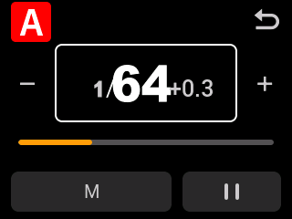
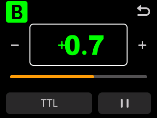
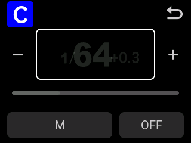
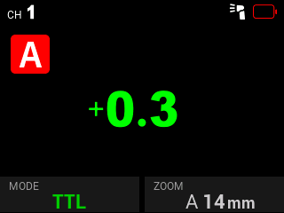
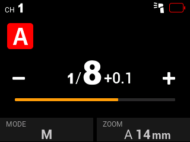

# V480F V1.03 · R10b 主控单灯页、从属直调与组别记忆

在 V480F 已发布的 rotary-direct v2 上移植 V100F R10 的主控单灯交互，并按 V480 的原生 **320×240** 屏幕重新排版。仅适用于仓库中精确匹配的 **V480F V1.03** 原件。

R10a 补充从属（Receiver）TTL/M 旋钮直调，并将主控单灯页的 A/B/C/D 字块恢复为原厂从属页的 **44×44** 尺寸、5 像素圆角和 29 像素字库，逐像素匹配。R10b 在此基础上加入从属 A–E 选组断电记忆，修复触屏选组未请求保存和非从属模式开机重置为 A 的两处问题。此前 R10 / R10a 交付目录保持不变。

## 操作

| 位置 | 操作 | 行为 |
| --- | --- | --- |
| 机顶 Wi-Off / 从属 Receiver | 未选中设置时直接转旋钮 | TTL 调补偿，M 调当前灯功率；从属 M 对应当前接收组 |
| 从属 TTL 页 | 旋钮后查看中央数值 | 原来的固定“TTL”改为原厂大号补偿数值和正负号，实时刷新 |
| 从属设置 | ZOOM、组别、模式选择或弹窗 | 保留原厂选择与旋钮操作，退出后恢复直调 |
| 从属组选项 A–E | 触屏确认，或旋钮选组后按 SET 确认 | 下一次原厂保存循环写入配置，关机重启恢复组别；切到机顶/主控后关机也保留 |
| 主控列表 M/A/B/C/D | 原来的长按 | 保留原厂 TTL / OFF / M 模式循环与时序 |
| 主控列表 | 横向滑动数值 | 保留原厂功率 / TTL 补偿调节；松手不进入单灯页 |
| 主控列表 | 纵向滑动 | 保留原厂列表滚动 |
| 主控列表 | 单击灯名或数值 | 进入对应灯的独立控制页 |
| 单灯页 | 左下 TTL/M | 切换该灯模式；暂停时预选恢复模式 |
| 单灯页 | 右下暂停图标 / OFF | 暂停 / 恢复该灯，保留 M 功率与 TTL 补偿 |
| 单灯页 | 旋钮、加减、滑条 | 只调整当前灯的 M 功率或 TTL 补偿 |
| 单灯页 | 返回图标、实体返回 | 返回主控列表并恢复到该灯的焦点 |

独立页沿用 V480 原厂大号数字、分数 / 小数与 TTL 正负号字库，A/B/C/D 使用原厂接收页的红 / 绿 / 蓝 / 青色，尺寸、圆角、字形及居中位置与原厂字块相同。旋钮在点击模式、暂停、数值或按 SET 后仍固定调整当前灯；暂停期间数值不变。

主控单灯页的暂停前模式记忆保存在当前主控页面的 LVGL 对象里，关闭并重新打开单灯页仍可恢复；不承诺跨关机或重建整个主控页面保存这项额外记忆。从属组别 A–E 则使用原厂非易失配置记录，已加入断电保存；重复选择相同组别不会额外写入，恢复出厂设置仍回到 A。该版本没有新增 SU-1 / 副灯支持，V100 的硬件功能不会随交互移植加入 V480。

原 v2 的 Wi-Off 机顶旋钮直调继续保留。从属直调只在 Receiver 正常页、无显式设置选择、无弹窗、无锁定/忙状态时接管；M 使用接收组原厂功率数组，TTL 使用原厂补偿字节，IRQ 临界区内临时选择后恢复。解码器保留既有 GUI 增量，不追加数值直调产生的导航增量。主控列表原回调和透明滑条保留，只附加短按观察器；超过 8 像素的移动、长按、取消事件均排除短按。参数调节调用 V480 原厂函数，暂停同步更新该组模式、启用位和无线掩码，不修改其他组的参数。

## 复现

从仓库根目录运行：

```sh
.venv/bin/python v480/r10/build.py
.venv/bin/python v480/r10/validate.py
.venv/bin/python v480/r10/package.py release-assets/v480-r10b-2026-10-10
```

依赖已有的 `v480/requirements.txt`、LLVM 20 / Clang 和 `ld.lld`，可通过 `GODOX_LLVM_BIN`、`GODOX_LD_LLD` 指定工具链。输入是 `firmware/V480F_V1.03.bin`，原件 SHA-256：`84ca232f50a62ceb2d9b24017a3b447a7154bf63f6461ef546a30a6b29077ebf`。

构建保留 v2 的 316 字节辅助段，独立页模块写入已确认的擦除填充区。生成 V480 自己的 payload MD5，保持文件长度、向量、scatter 初始化、辅助镜像和版本尾部。打包必须通过候选、源码及测试报告摘要核对，拒绝覆盖现有目录。`PATCH_MANIFEST.json` 包含完整可逆变更记录；文件逆变换不等于设备恢复保证。

验证执行 V480 的真实 ARM 指令、LVGL 对象、原厂触摸长按和滚动逻辑以及旋钮 GPIO → 参数消费 → GUI 轮询链路。触摸采样、GPIO、LCD 传输和少量唤醒服务由离线环境替代。截图使用单缓冲；交付固件保持原厂显示配置。

组别保存验证执行原厂配置序列化、比较、Flash 写字指令、25 条记录轮换和开机恢复，并仅将 Flash 数据带入全新 RAM 的模拟开机。Flash 状态寄存器及擦除效果由模型替代。确认选组后须完成下一次原厂保存循环才持久化；写入或擦除中突然断电的原子性、实体 Flash 保持性和时序仍需真机验收。

**这是本地实验候选，尚未进行本版本真机验收，本轮没有刷写设备。** 离线检查不代表实体触摸、旋钮、LCD、无线延迟或实际受控闪光验收。

## 本轮结果（2026-10-10，R10b）

- **23,652 项功能检查通过**：主控原生 UI / 触摸 / 旋钮 2,766 项，从属直调与字块一致性 6,875 项，既有 v2 机顶直调与回落 12,489 项，新增组别保存 / 冷启动恢复 1,522 项。
- **1,562 次原厂通信 ISR 插入**通过：机顶 842 次、从属模式及页面切换 720 次，过期模式写入为 0；**53 项镜像完整性检查**通过，完整逆变换精确恢复官方原件。
- 50 次单灯页开关通过；原厂动画回收后堆占用保持在预热基线 **40,592 字节**以内。
- 原补丁工具的 10 项单元测试通过。
- BIN：`v480f-v1.03r10b.bin`，**753,705 字节**；SHA-256：`a97628e92d62b2918ff3091da264c155c4525abf7fc850734b1cbe8445d55bc2`。
- [完整验证](evidence/VALIDATION.json) · [主控界面与输入](evidence/R10_UI_RESULTS.json) · [从属直调与原厂字块](evidence/RX_BADGE_RESULTS.json) · [组选项保存与冷启动恢复](evidence/RX_PERSISTENCE_RESULTS.json) · [镜像校验](evidence/IMAGE_INTEGRITY.json) · [从属中断检查](evidence/receiver_interrupt_tests.json)。

以下为实际 V480 ARM / LVGL 的离线渲染，非实体 LCD 照片。

| M 功率 | TTL 补偿 | 暂停 |
| --- | --- | --- |
|  |  |  |

| 从属 TTL 补偿 | 从属 M 功率 |
| --- | --- |
|  |  |

## English

V480F-specific port of the V100F R10 Sender group-editor interaction, laid out for the native 320×240 display. Stock list long press, horizontal parameter swipes, vertical scrolling and +/- controls remain. A short tap opens M/A–D independently; the editor provides TTL/M, pause/resume, native power/FEC typography and a power-only encoder, including after SET or touch interactions.

R10a adds direct Receiver TTL compensation / current RX-group M power with no active setting selection; native selectors, modal choosers, locks and transitions retain their original behavior. Receiver TTL now displays and refreshes the native compensation value. Sender A–D badges match the original Receiver 44×44 geometry, round corners, font and colors pixel for pixel. The published Wi-Off direct-rotary v2 behavior is retained. This does not add accessory/SU-1 support. Only exact V480F V1.03 input is supported. Packaging requires source-bound native-instruction/UI, baseline, interrupt and full-image checks. Hardware acceptance remains pending; no device is written by these tools.

R10b remembers the confirmed Receiver A–E group in the original nonvolatile settings record, including after switching to Wi-Off or Sender before shutdown. It requests the native main-loop save service after touch/SET confirmation, skips unchanged groups and retains the original record rotation and factory-reset default A. Cold-boot tests carry only flash contents into fresh RAM and verify the Receiver badge, group and radio/palette index. Physical retention and power interruption during native programming/erase remain unverified.
